---
## Front matter
title: "Лабораторная работа №3"
subtitle: "Язык разметки Markdown"
author: "Ромицына Анастасия Романовна  НПИбд-02-23"

## Generic otions
lang: ru-RU
toc-title: "Содержание"

## Bibliography
bibliography: bib/cite.bib
csl: pandoc/csl/gost-r-7-0-5-2008-numeric.csl

## Pdf output format
toc: true # Table of contents
toc-depth: 2
lof: true # List of figures
lot: true # List of tables
fontsize: 12pt
linestretch: 1.5
papersize: a4
documentclass: scrreprt
## I18n polyglossia
polyglossia-lang:
  name: russian
  options:
	- spelling=modern
	- babelshorthands=true
polyglossia-otherlangs:
  name: english
## I18n babel
babel-lang: russian
babel-otherlangs: english
## Fonts
mainfont: PT Serif
romanfont: PT Serif
sansfont: PT Sans
monofont: PT Mono
mainfontoptions: Ligatures=TeX
romanfontoptions: Ligatures=TeX
sansfontoptions: Ligatures=TeX,Scale=MatchLowercase
monofontoptions: Scale=MatchLowercase,Scale=0.9
## Biblatex
biblatex: true
biblio-style: "gost-numeric"
biblatexoptions:
  - parentracker=true
  - backend=biber
  - hyperref=auto
  - language=auto
  - autolang=other*
  - citestyle=gost-numeric
## Pandoc-crossref LaTeX customization
figureTitle: "Рис."
tableTitle: "Таблица"
listingTitle: "Листинг"
lofTitle: "Список иллюстраций"
lotTitle: "Список таблиц"
lolTitle: "Листинги"
## Misc options
indent: true
header-includes:
  - \usepackage{indentfirst}
  - \usepackage{float} # keep figures where there are in the text
  - \floatplacement{figure}{H} # keep figures where there are in the text
---

# Цель работы

Познакомиться с возможностями разметки Markdown и оформить в ней лабораторную работу №2.

# Задание

Сделать отчет по лабораторной работе №2 в формате Markdown и загрузить на github.

# Выполнение лабораторной работы

Переходим в каталог курса (рис. @fig:001).

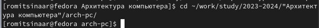{#fig:001 width=70%}

Обновляем локальный репозиторий (рис. @fig:002).

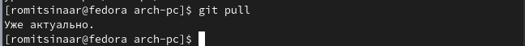{#fig:002 width=70%}

Переходим в каталог с шаблоном отчёта (рис. @fig:003).

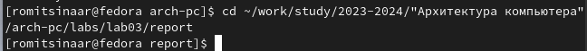{#fig:003 width=70%}

Проводим компиляцию шаблона (рис. @fig:004).

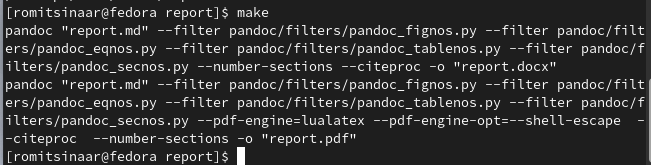{#fig:004 width=70%}

Проверяем корректность полученных файлов (рис. @fig:005).

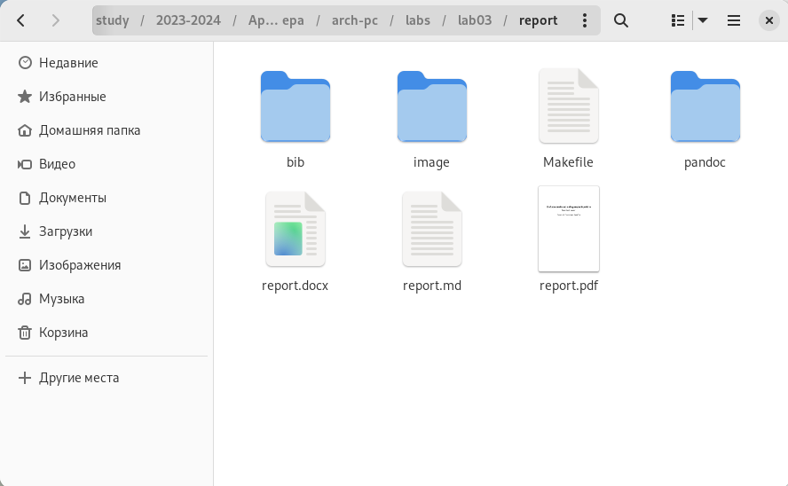{#fig:005 width=70%}

Удаляем недавно созданные файлы (рис. @fig:006).

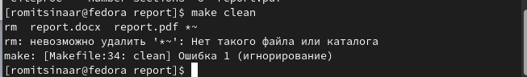{#fig:006 width=70%}

Проверяем, удалились ли файлы (рис. @fig:007).

{#fig:007 width=70%}

Открываем файл report.md в текстовом редакторе (рис. @fig:008).

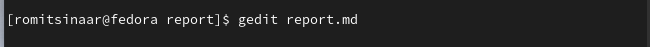{#fig:008 width=70%}

Изучаем данный файл и приступаем к его оформлению для лабораторной работы (рис. @fig:009).

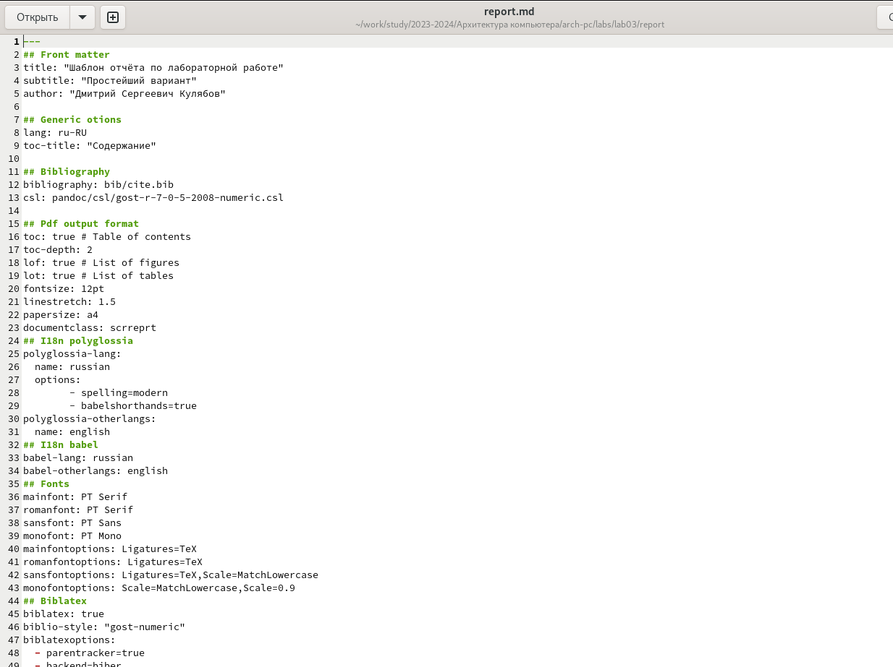{#fig:009 width=70%}

# Заполнение отчета по лабораторной работе №2

1.Базовая настройка git.

Сначала сделаем предварительную конфигурацию git. Откроем терминал и введем следующие команды, указав имя и email владельца репозитория (рис. @fig:001).

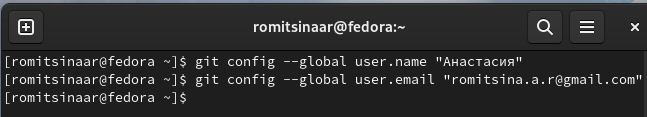{#fig:001 width=70%}

Настроим utf-8 в выводе сообщений git(рис. @fig:002).

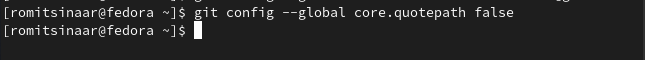{#fig:002 width=70%}

Зададим имя начальной ветки(будем называть ее master)(рис. @fig:003).

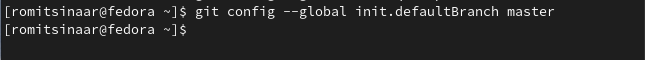{#fig:003 width=70%}

Параметр autocrlf(рис. @fig:004).

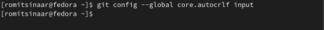{#fig:004 width=70%}

Параметр safecrlf(рис. @fig:005).

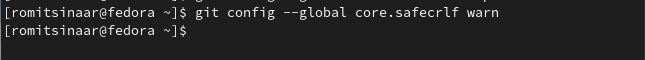{#fig:005 width=70%}

Для последующей идентификации пользователя на сервере репозиториев необходимо сгенерировать пару ключий(приватный и открытый)(рис. @fig:006).

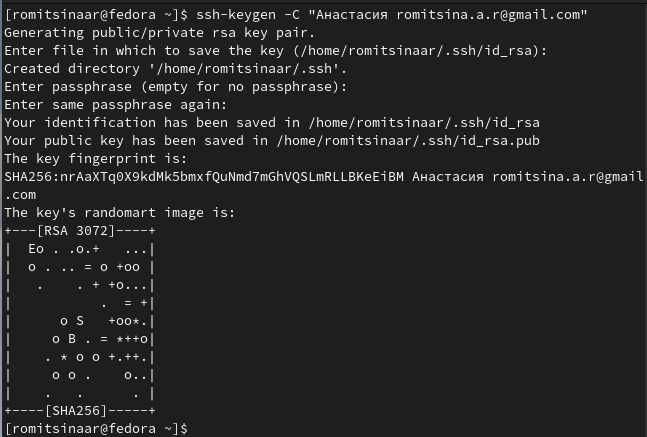{#fig:006 width=70%}

Далее необходимо загрузить сгенерированный ключ. Для этого мы должны скопировать его(команда cat) (рис. @fig:007), зайти на сайт github, перейти в настройки, ключи SSH и вставить скопрированный ключ.

{#fig:007 width=70%}

Открываем консоль и создаем каталог для "Архитектура компьютера"(рис. @fig:008).

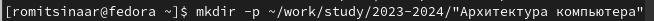{#fig:008 width=70%}

Клонируем созданный репозиторий(рис. @fig:009).

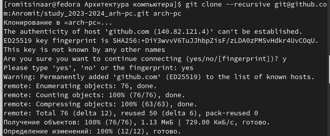{#fig:009 width=70%}

Переходим в папку arch-pc и удаляем лишние файлы(рис. @fig:010).

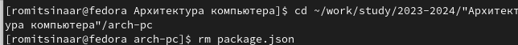{#fig:010 width=70%}

Необходимо создать все каталоги(рис. @fig:011).

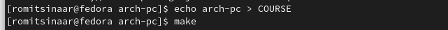{#fig:011 width=70%}
# Выводы

Мы познакомились с языком разметки Markdown и оформили отчет по лабораторным работам №2 и №3.

