---
## Front matter
title: "Лабораторная работа 4"
subtitle: "Язык ассамблера NASM"
author: "Ромицына Анастасия Романовна НПИбд-02-23"

## Generic otions
lang: ru-RU
toc-title: "Содержание"

## Bibliography
bibliography: bib/cite.bib
csl: pandoc/csl/gost-r-7-0-5-2008-numeric.csl

## Pdf output format
toc: true # Table of contents
toc-depth: 2
lof: true # List of figures
lot: true # List of tables
fontsize: 12pt
linestretch: 1.5
papersize: a4
documentclass: scrreprt
## I18n polyglossia
polyglossia-lang:
  name: russian
  options:
	- spelling=modern
	- babelshorthands=true
polyglossia-otherlangs:
  name: english
## I18n babel
babel-lang: russian
babel-otherlangs: english
## Fonts
mainfont: PT Serif
romanfont: PT Serif
sansfont: PT Sans
monofont: PT Mono
mainfontoptions: Ligatures=TeX
romanfontoptions: Ligatures=TeX
sansfontoptions: Ligatures=TeX,Scale=MatchLowercase
monofontoptions: Scale=MatchLowercase,Scale=0.9
## Biblatex
biblatex: true
biblio-style: "gost-numeric"
biblatexoptions:
  - parentracker=true
  - backend=biber
  - hyperref=auto
  - language=auto
  - autolang=other*
  - citestyle=gost-numeric
## Pandoc-crossref LaTeX customization
figureTitle: "Рис."
tableTitle: "Таблица"
listingTitle: "Листинг"
lofTitle: "Список иллюстраций"
lotTitle: "Список таблиц"
lolTitle: "Листинги"
## Misc options
indent: true
header-includes:
  - \usepackage{indentfirst}
  - \usepackage{float} # keep figures where there are in the text
  - \floatplacement{figure}{H} # keep figures where there are in the text
---

# Цель работы

Освоение процедуры компиляции и сборки программ, написанных на ассамблере NASM

# Задание
Скомпилировать файлы и загрузить их на githab

# Выполнение лабораторной работы

1.1 Программа Hello world!
Рассмотрим пример простой программы на языке ассемблера NASM. Традиционно первая
программа выводит приветственное сообщение Hello world! на экран.
Создадим каталог для работы с программами на языке ассемблера NASM:(рис. @fig:001)

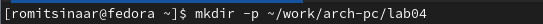{#fig:001 width=70%}

1.2 Перейдите в созданный каталог(рис. @fig:002)

{#fig:002 width=70%}

1.3 Cоздаем текстовый файл с именем hello.asm(рис. @fig:003)

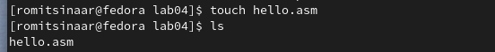{#fig:003 width=70%}

1.4 Oткрываем этот файл с помощью любого текстового редактора, например, gedit(рис. @fig:004)

{#fig:004 width=70%}

1.5 Вводим в него следующий текст:(рис. @fig:005)

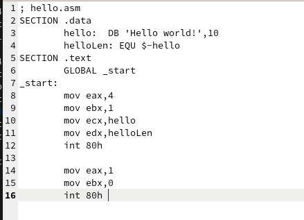{#fig:005 width=70%}

2 NASM превращает текст программы в объектный код. Например, для компиляции приве-
дённого выше текста программы «Hello World» необходимо написать:(рис. @fig:006)

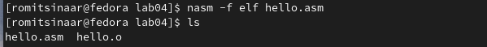{#fig:006 width=70%}

3 Выполняем следующую команду, Данная команда скомпилирует исходный файл hello.asm в obj.o (опция -o позволяет задать имя объектного файла, в данном случае obj.o), при этом формат выходного файла
будет elf, и в него будут включены символы для отладки (опция -g), кроме того, будет создан
файл листинга list.lst (опция -l).
С помощью команды ls проверьте, что файлы были созданы.(рис. @fig:007)

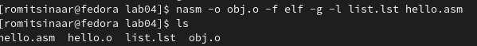{#fig:007 width=70%}

4.1 чтобы получить исполняемую программу, объектный файл
необходимо передать на обработку компоновщику:(рис. @fig:008)

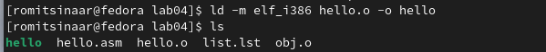{#fig:008 width=70%}

4.2 Ключ -o с последующим значением задаёт в данном случае имя создаваемого исполняемого файла.
Выполняем следующую команду:(рис. @fig:009)

{#fig:009 width=70%}

5 Запустить на выполнение созданный исполняемый файл, находящийся в текущем каталоге,
можно, набрав в командной строке (рис. @fig:010)

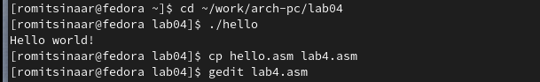{#fig:010 width=70%}

6.1 В каталоге ~/work/arch-pc/lab04 с помощью команды cp создайте копию файла
hello.asm с именем lab4.asm(рис. @fig:011)

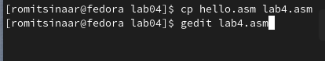{#fig:011 width=70%}

6.2 С помощью любого текстового редактора вносим изменения в текст программы в
файле lab4.asm так, чтобы вместо Hello world! на экран выводилась строка с моим
фамилией и именем.(рис. @fig:012)

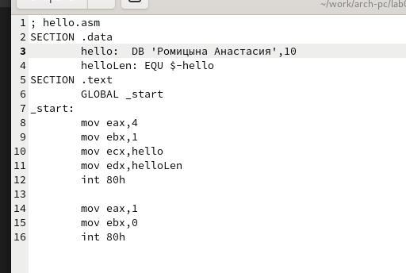{#fig:012 width=70%}

6.3 Оттранслируем полученный текст программы lab4.asm в объектный файл. Выполним
компоновку объектного файла и запустим получившийся исполняемый файл.(рис. @fig:013)

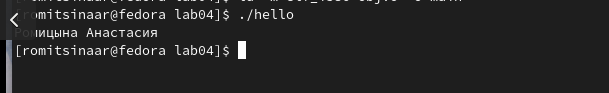{#fig:013 width=70%}

6.4 Скопируем файлы hello.asm и lab4.asm в Ваш локальный репозиторий в ката-
лог ~/work/study/2023-2024/"Архитектура компьютера"/arch-pc/labs/lab04/.(рис. @fig:014)

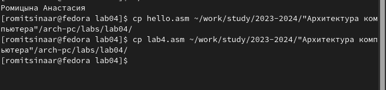{#fig:014 width=70%}

# Выводы
Мы смогли освоить процедуры компиляции и сборки программ, написанных на ассамблере NASM.

