---
## Front matter
title: "Лабораторная работа №6"
subtitle: "Работа с NASM"
author: "Ромицына Анасасия Романовна"

## Generic otions
lang: ru-RU
toc-title: "Содержание"

## Bibliography
bibliography: bib/cite.bib
csl: pandoc/csl/gost-r-7-0-5-2008-numeric.csl

## Pdf output format
toc: true # Table of contents
toc-depth: 2
lof: true # List of figures
lot: true # List of tables
fontsize: 12pt
linestretch: 1.5
papersize: a4
documentclass: scrreprt
## I18n polyglossia
polyglossia-lang:
  name: russian
  options:
	- spelling=modern
	- babelshorthands=true
polyglossia-otherlangs:
  name: english
## I18n babel
babel-lang: russian
babel-otherlangs: english
## Fonts
mainfont: PT Serif
romanfont: PT Serif
sansfont: PT Sans
monofont: PT Mono
mainfontoptions: Ligatures=TeX
romanfontoptions: Ligatures=TeX
sansfontoptions: Ligatures=TeX,Scale=MatchLowercase
monofontoptions: Scale=MatchLowercase,Scale=0.9
## Biblatex
biblatex: true
biblio-style: "gost-numeric"
biblatexoptions:
  - parentracker=true
  - backend=biber
  - hyperref=auto
  - language=auto
  - autolang=other*
  - citestyle=gost-numeric
## Pandoc-crossref LaTeX customization
figureTitle: "Рис."
tableTitle: "Таблица"
listingTitle: "Листинг"
lofTitle: "Список иллюстраций"
lotTitle: "Список таблиц"
lolTitle: "Листинги"
## Misc options
indent: true
header-includes:
  - \usepackage{indentfirst}
  - \usepackage{float} # keep figures where there are in the text
  - \floatplacement{figure}{H} # keep figures where there are in the text
---

# Цель работы
Освоение арифметических инструкций языка ассемблера NASM
# Задание

Написпть собственную прорамму.

# Выполнение лабораторной работы

Создаем каталог для программам лабораторной работы No 6, переходим в него и
создаем файл lab6-1.asm: (рис. @fig:001).

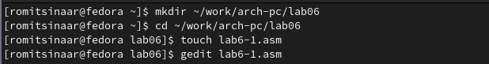{#fig:001 width=70%}

Рассмотрим примеры программ вывода символьных и численных значений. Программы будут выводить значения записанные в регистр eax. Вводим в файл lab6-1.asm текст программы из листинга 6.1.(рис. @fig:002).

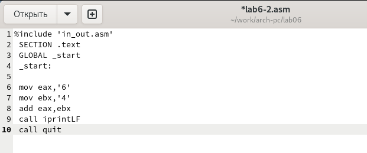{#fig:002 width=70%}

Создайте исполняемый файл и запустите его.(рис. @fig:003).

{#fig:003 width=70%}

Далее изменим текст программы и вместо символов, запишем в регистры числа. Ис-
правим текст программы (Листинг 6.1) следующим образом: (рис. @fig:004).

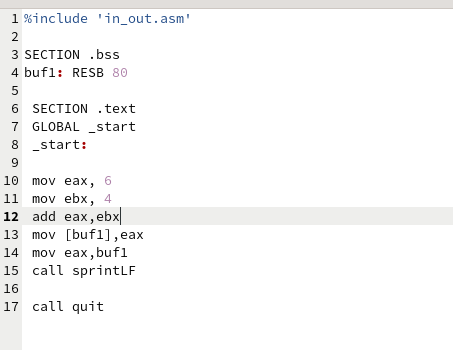{#fig:004 width=70%}

Создайте исполняемый файл и запустите его (рис. @fig:005).

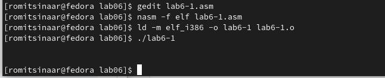{#fig:005 width=70%}

Согласно таблице код 10 соответствует переносу на след строку, это программа и выводит.

Создадим файл lab6-2.asm в каталоге ~/work/arch-pc/lab06 (рис. @fig:006).

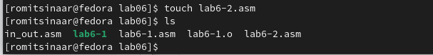{#fig:006 width=70%}

Введем в него текст программы из листинга 6.2 (рис. @fig:007).

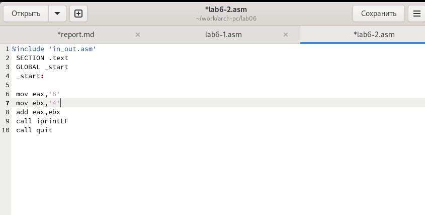{#fig:007 width=70%}

Создадим исполняемый файл и запустим его.(рис. @fig:008).

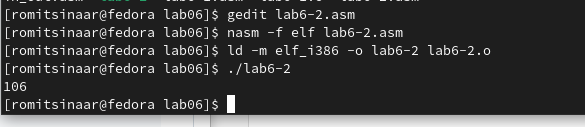{#fig:008 width=70%}

Аналогично предыдущему примеру изменим символы на числа.(рис. @fig:009).

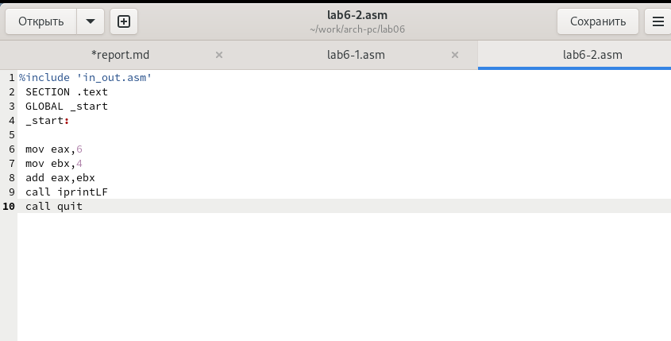{#fig:009 width=70%}

Создадим исполняемый файл и запустим его.(рис. @fig:010).

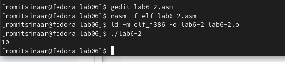{#fig:010 width=70%}

Создадим файл lab6-3.asm в каталоге ~/work/arch-pc/lab06 (рис. @fig:011).

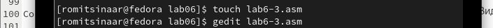{#fig:011 width=70%}

Внимательно изучаем текст программы из листинга 6.3 и вводим в lab6-3.asm.(рис. @fig:012).

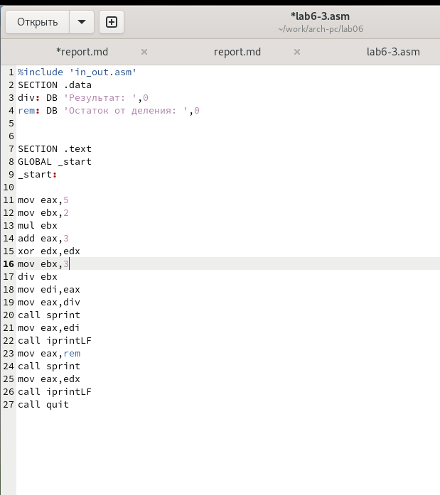{#fig:012 width=70%}

Создаем исполняемый файл и запускаем его. Результат работы программы должен быть
следующим:(рис. @fig:013).

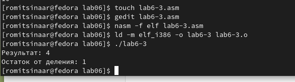{#fig:013 width=70%}

Изменяем текст программы для вычисления выражения 𝑓(𝑥) = (4 ∗ 6 + 2)/5. (рис. @fig:014).

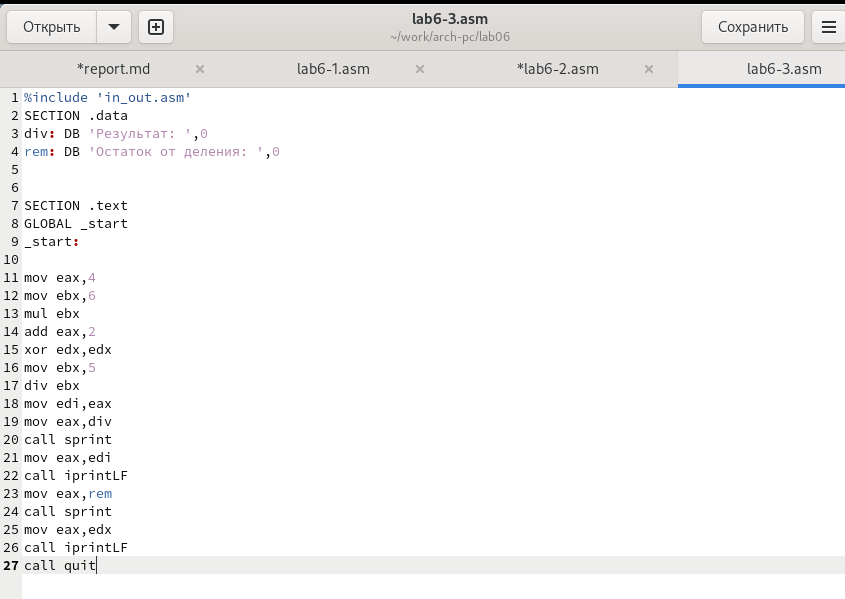{#fig:014 width=70%}

Создаем исполняемый файл и проверяем его работу. (рис. @fig:015).

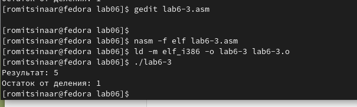{#fig:015 width=70%}

Создаем файл variant.asm в каталоге ~/work/arch-pc/lab06: рис. @fig:016).

{#fig:016 width=70%}

Внимательно изучаем текст программы из листинга 6.4 и вводим в файл variant.asm.(рис. @fig:017).

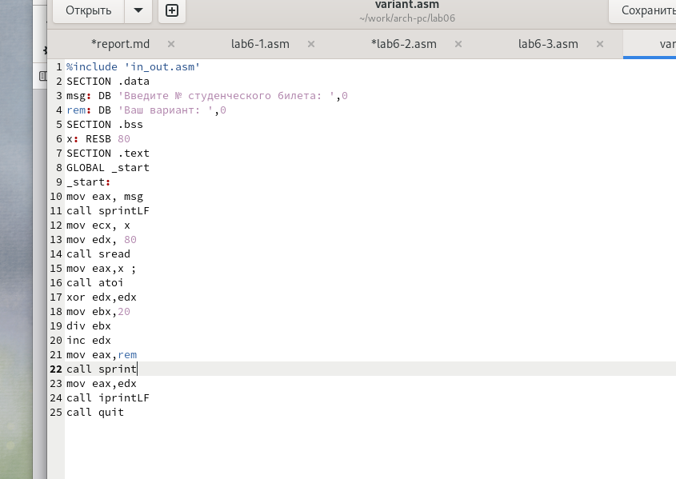{#fig:017 width=70%}

Создаем исполняемый файл и запускаем его. (рис. @fig:018).

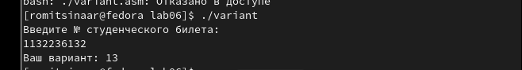{#fig:018 width=70%}

Ответы на вопросы

1 Строка "mov eax,rem" и строка "call sprint" отвечают за вывод на экран сообщения ‘Ваш вариант:'.
2 Эти инструкции используются для чтения строки с вводом данных от пользователя. Начальный адрес строки сохраняется в регистре ecx, а количество символов в строке (максимальное количество символов, которое может быть считано) сохраняется в регистре edx. Затем вызывается процедура sread, которая выполняет чтение строки.
3 Инструкция "call atoi" используется для преобразования строки в целое число. Она принимает адрес строки в регистре eax и возвращает полученное число в регистре eax.
4 Строка "xor edx,edx" обнуляет регистр edx перед выполнением деления. Строка "mov ebx,20" загружает значение 20 в регистр ebx. Строка "div ebx" выполняет деление регистра eax на значение регистра ebx с сохранением частного в регистре eax и остатка в регистре edx.
5 Остаток от деления записывается в регистр edx.
6 Инструкция "inc edx" используется для увеличения значения в регистре edx на 1. В данном случае, она увеличивает остаток от деления на 1.
7 Строка "mov eax,edx" передает значение остатка от деления в регистр eax. Строка "call iprintLF" вызывает процедуру iprintLF для вывода значения на экран вместе с переводом строки.

# Задания для самостоятельной работы

Создадим файл для выполнения самостоятельной работы . (рис. @fig:019).

{#fig:019 width=70%}

Откроем новый файл в редакторе. (рис. @fig:020).

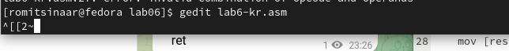{#fig:020 width=70%}

Напишем программу для выполнения задания. (рис. @fig:021).

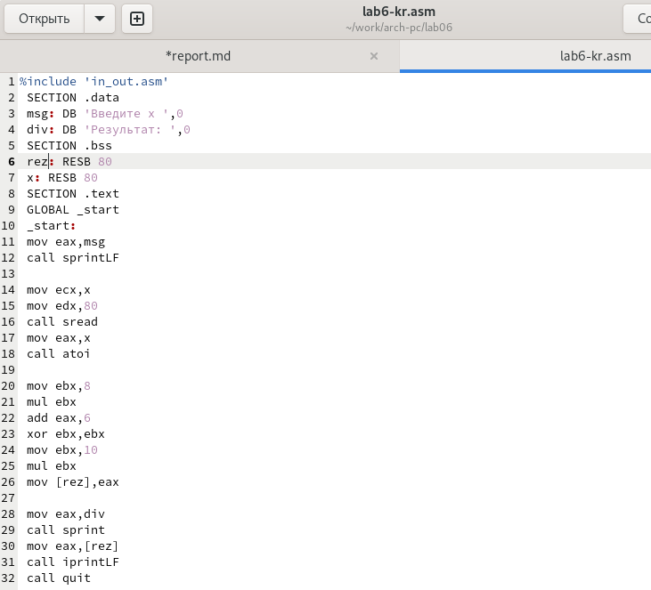{#fig:021 width=70%}

Запустим программу и проверим правильность её работы. Все работает верно. (рис. @fig:022).

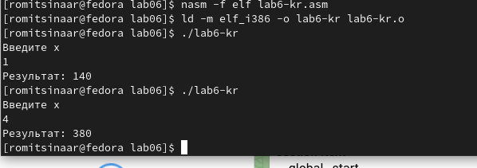{#fig:022 width=70%}

# Выводы

Мы освоили арифметические инструкции языка ассемблера NASM.

