---
## Front matter
title: "Лабораторная работа №7"
subtitle: "Адресация IPv4 и IPv6. Настройка DHCP"
author: "Ромицына Анастасия Романовна"

## Generic otions
lang: ru-RU
toc-title: "Содержание"

## Bibliography
bibliography: bib/cite.bib
csl: pandoc/csl/gost-r-7-0-5-2008-numeric.csl

## Pdf output format
toc: true # Table of contents
toc-depth: 2
lof: true # List of figures
lot: true # List of tables
fontsize: 12pt
linestretch: 1.5
papersize: a4
documentclass: scrreprt
## I18n polyglossia
polyglossia-lang:
  name: russian
  options:
	- spelling=modern
	- babelshorthands=true
polyglossia-otherlangs:
  name: english
## I18n babel
babel-lang: russian
babel-otherlangs: english
## Fonts
mainfont: PT Serif
romanfont: PT Serif
sansfont: PT Sans
monofont: PT Mono
mainfontoptions: Ligatures=TeX
romanfontoptions: Ligatures=TeX
sansfontoptions: Ligatures=TeX,Scale=MatchLowercase
monofontoptions: Scale=MatchLowercase,Scale=0.9
## Biblatex
biblatex: true
biblio-style: "gost-numeric"
biblatexoptions:
  - parentracker=true
  - backend=biber
  - hyperref=auto
  - language=auto
  - autolang=other*
  - citestyle=gost-numeric
## Pandoc-crossref LaTeX customization
figureTitle: "Рис."
tableTitle: "Таблица"
listingTitle: "Листинг"
lofTitle: "Список иллюстраций"
lotTitle: "Список таблиц"
lolTitle: "Листинги"
## Misc options
indent: true
header-includes:
  - \usepackage{indentfirst}
  - \usepackage{float} # keep figures where there are in the text
  - \floatplacement{figure}{H} # keep figures where there are in the text
---

# Цель работы

Целью данной работы является получение навыков настройки службы DHCP на сетевом оборудовании для распределения адресов IPv4 и IPv6.

# Выполнение лабораторной работы

Запустим GNS3 VM и GNS3 и создадим новый проект(рис. [-@fig:001]).

{#fig:001 width=70%}

В рабочем пространстве разместим и соединим устройства в соответствии с топологией, приведённой в лабораторной работе. Используем маршрутизатор VyOS и хост (клиент) VPCS. После чего изменим отображаемые названия устройств. Коммутаторам присвоим названия arromichina-sw-0x, маршрутизаторам — arromichina-gw-0x, VPCS — PCx-arromichina, где вместо x — порядковый номер устройства (рис. [-@fig:002]).

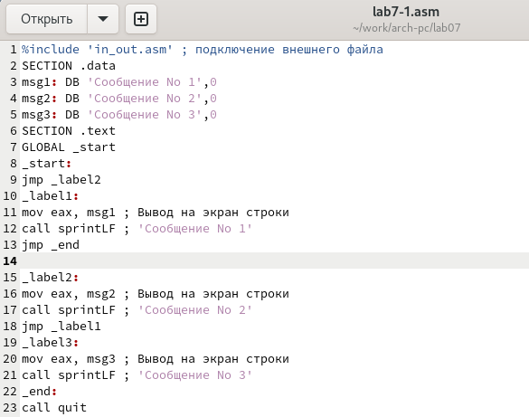{#fig:002 width=70%}

Включим захват трафика на соединении между коммутатором sw-01 и маршрутизатором gw-01(рис. [-@fig:003]).

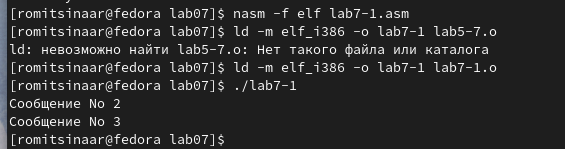{#fig:003 width=70%}

Настроим образ VyOS. На маршрутизаторах перейдём в режим конфигурирования, изменим имя устройства и доменное имя, заменим системного пользователя, заданного по умолчанию, на нашего пользователя(рис. [-@fig:004]).

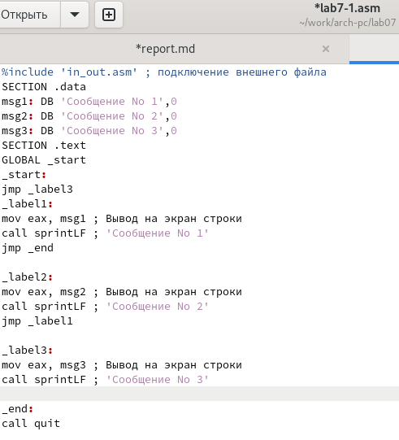{#fig:004 width=70%}

На маршрутизаторе под созданным пользователем перейдём в режим конфигурирования и настроим адресацию IPv4. Добавим конфигурацию DHCP-сервера на маршрутизаторе. Здесь была создана разделяемая сеть (shared-network-name) с названием arromichina, подсеть (subnet) с адресом 10.0.0.0/24, задан диапазон адресов (range) с именем hosts, содержащий адреса 10.0.0.2–10.0.0.253 (рис. [-@fig:005]).

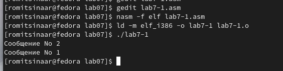{#fig:005 width=70%}

Просмотрим статистику DHCP-сервера и выданных адресов (рис. [-@fig:006]).

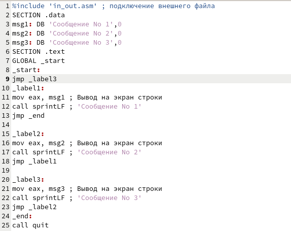{#fig:006 width=70%}

Настроим оконечное устройство PC1-arromichina. Здесь использована опция -d для обеспечения возможности просмотра декодированных запросов DHCP  (рис. [-@fig:007]).

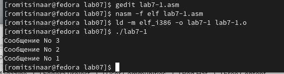{#fig:007 width=70%}

Проверим конфигурацию IPv4 на узле и пропингуем маршрутизатор(рис. [-@fig:008]).

{#fig:008 width=70%}

На маршрутизаторе вновь просмотрим статистику DHCP-сервера и выданные адреса (рис. [-@fig:009]).

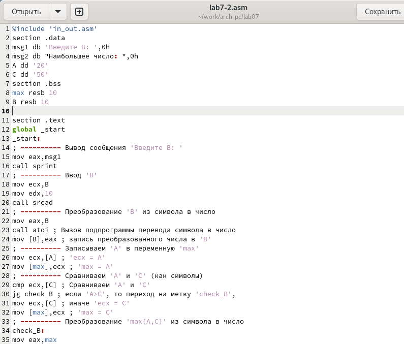{#fig:009 width=70%}

Теперь просмотрим журнал работы DHCP-сервера(рис. [-@fig:010]).

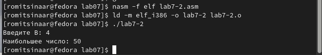{#fig:010 width=70%}

Проанализируем захваченные анализатором трафика пакеты(рис. [-@fig:027]).

{#fig:027 width=70%}

Добавим образ Kali Linux CLI в перечень устройств в GNS3(рис. [-@fig:011]).

{#fig:011 width=70%}

В предыдущем проекте в рабочем пространстве дополним сеть, разместив и соединив устройства в соответствии с топологией, приведённой в лабораторной работе. Используем хост (клиент) Kali Linux CLI, поскольку клиент VPCS не поддерживает DHCPv6. Изменим отображаемые названия устройств. Коммутаторам присвоим названия arromichina-sw-0x, маршрутизаторам — arromichina-gw-0x, VPCS — PCx-arromichina, где вместо x — порядковый номер устройства(рис. [-@fig:012]).

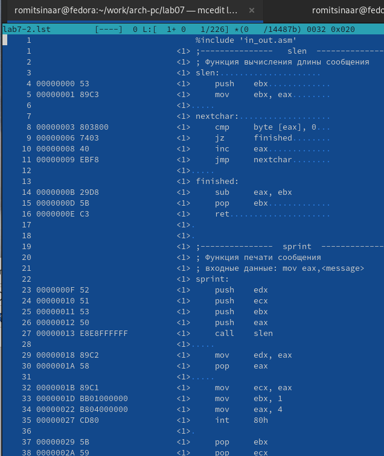{#fig:012 width=70%}

Включим захват трафика на соединениях между маршрутизатором gw-01 и коммутаторами sw-02 и sw-03 (рис. [-@fig:013]).

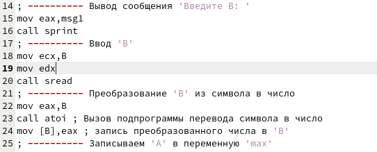{#fig:013 width=70%}

Настроим адресацию IPv6 на маршрутизаторе(рис. [-@fig:014]).

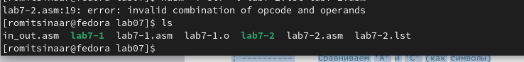{#fig:014 width=70%}

На маршрутизаторе настроим DHCPv6 без отслеживания состояния (DHCPv6 Stateless configuration). Настроим объявления о маршрутизаторах (Router Advertisements, RA) на интерфейсе eth1. Опция other-config-flag означает, что для конфигурации не адресных параметров использует протокол с сохранением состояния. Добавим конфигурации DHCP-сервера. Здесь была создана разделяемая сеть (sharednetwork-name) с названием arromichina, задана информация общих опций (common-options) для разделяемой сети. При этом подсеть (subnet) 2000::/64 не требуется настраивать, поскольку она не будет содержать полезной информации (рис. [-@fig:015]).

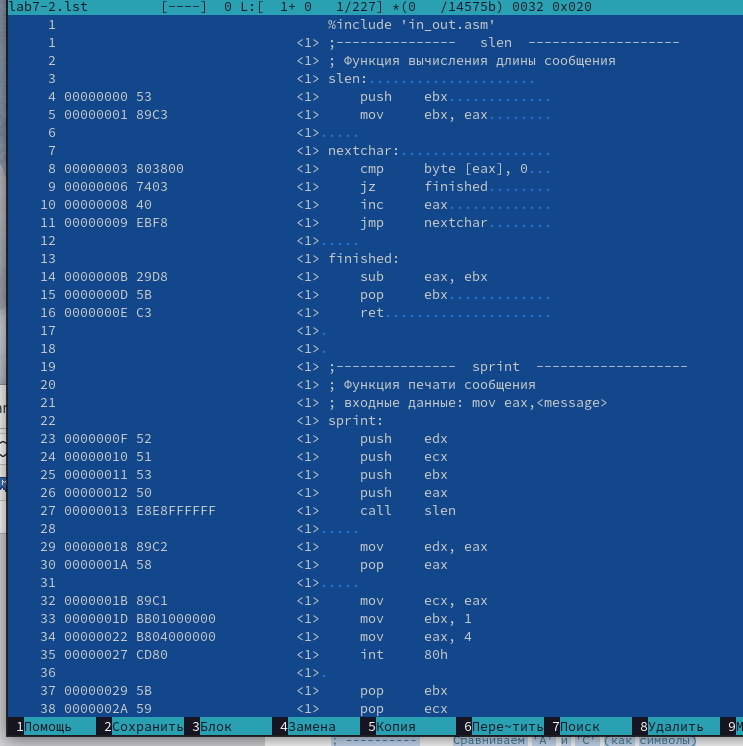{#fig:015 width=70%}

На узле PC2-arromichina проверим настройки сети (рис. [-@fig:016]).

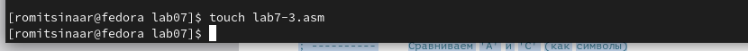{#fig:016 width=70%}

На узле PC2-arromichina пропингуем маршрутизатор, проверим настройки DNS, получим адрес по DHCPv6. Опция -6 указывает на использование протокола DHCPv6, опция -S — на запрос только информации DHCPv6, но не адреса, опция -v — на вывод на экран подробной информации(рис. [-@fig:017]).

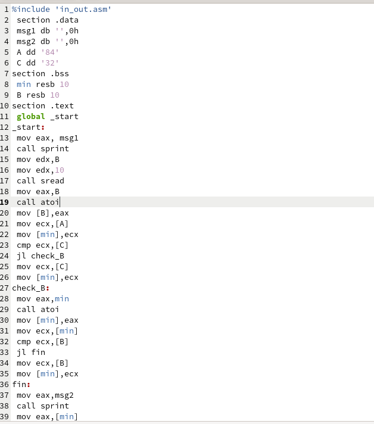{#fig:017 width=70%}

Вновь пропингуем от узла PC2-arromichina маршрутизатор и проверим настройки DNS (рис. [-@fig:018]).

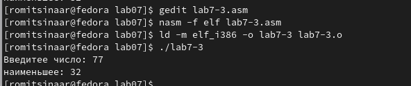{#fig:018 width=70%}

На маршрутизаторе просмотрим статистику DHCP-сервера и выданные адреса(рис. [-@fig:019]).

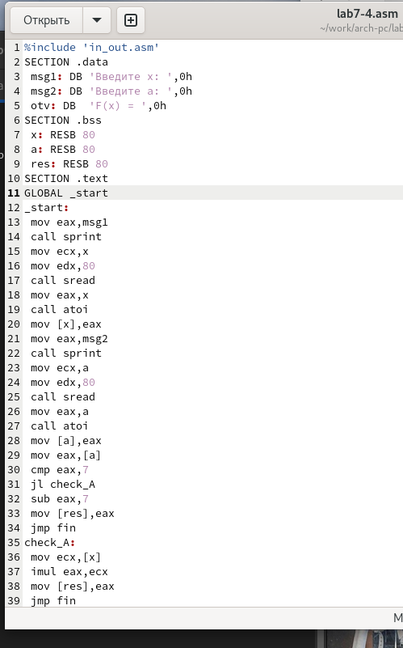{#fig:019 width=70%}

Проанализируем захваченные анализатором трафика пакеты(рис. [-@fig:028]).

{#fig:028 width=70%}

На маршрутизаторе настроим DHCPv6 с отслеживанием состояния (DHCPv6 Stateful configuration). На интерфейсе eth2 маршрутизатора настроим объявления о маршрутизаторах (Router Advertisements, RA). Опция managed-flag означает, что хосты использует администрируемый (отслеживающий состояние) протокол для автоматической настройки адресов в дополнение к любым адресам, автоматически настраиваемым с помощью SLAAC.  Добавим конфигурацию DHCP-сервера на маршрутизатор. Здесь создана разделяемая сеть (shared-network-name) с названием arromichina, подсеть (subnet) с адресом 2001::/64, задан диапазон адресов (range) с именем hosts, содержащий адреса 2001::100 – 2001::199(рис. [-@fig:020]).

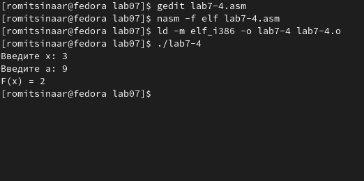{#fig:020 width=70%}

На маршрутизаторе просмотрим статистику DHCP-сервера и выданные адреса(рис. [-@fig:021]).

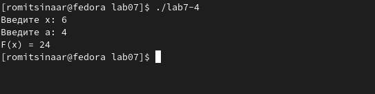{#fig:021 width=70%}

Подключимся к узлу PC3-arromichina и проверим настройки сети(рис. [-@fig:022]).

{#fig:022 width=70%}

На узле PC3-arromichina проверим настройки DNS и получим адрес по DHCPv6(рис. [-@fig:023]).

{#fig:023 width=70%}

Вновь на узле PC3-arromichina проверим настройки сети, пропингуем маршрутизатор и проверим настройки DNS(рис. [-@fig:024]).

{#fig:024 width=70%}

На маршрутизаторе просмотрим статистику DHCP-сервера и выданные адреса(рис. [-@fig:025]).

{#fig:025 width=70%}

Проанализируем захваченные анализатором трафика пакеты(рис. [-@fig:026]).

{#fig:026 width=70%}

# Выводы

В ходе выполнения лабораторной работы мы получили навыки настройки службы DHCP на сетевом оборудовании для распределения адресов IPv4 и IPv6.

# Список литературы{.unnumbered}

::: {#refs}
:::
