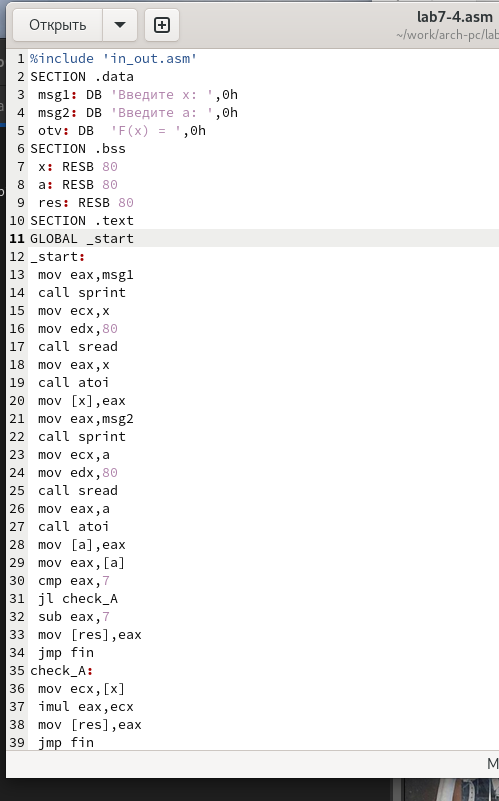

---
## Front matter
title: "Лабораторная работа No7. Команды безусловного и
условного переходов в Nasm. Программирование
ветвлений"
subtitle: ""
author: "Ромицына Анастасия Романовна"

## Generic otions
lang: ru-RU
toc-title: "Содержание"

## Bibliography
bibliography: bib/cite.bib
csl: pandoc/csl/gost-r-7-0-5-2008-numeric.csl

## Pdf output format
toc: true # Table of contents
toc-depth: 2
lof: true # List of figures
lot: true # List of tables
fontsize: 12pt
linestretch: 1.5
papersize: a4
documentclass: scrreprt
## I18n polyglossia
polyglossia-lang:
  name: russian
  options:
	- spelling=modern
	- babelshorthands=true
polyglossia-otherlangs:
  name: english
## I18n babel
babel-lang: russian
babel-otherlangs: english
## Fonts
mainfont: PT Serif
romanfont: PT Serif
sansfont: PT Sans
monofont: PT Mono
mainfontoptions: Ligatures=TeX
romanfontoptions: Ligatures=TeX
sansfontoptions: Ligatures=TeX,Scale=MatchLowercase
monofontoptions: Scale=MatchLowercase,Scale=0.9
## Biblatex
biblatex: true
biblio-style: "gost-numeric"
biblatexoptions:
  - parentracker=true
  - backend=biber
  - hyperref=auto
  - language=auto
  - autolang=other*
  - citestyle=gost-numeric
## Pandoc-crossref LaTeX customization
figureTitle: "Рис."
tableTitle: "Таблица"
listingTitle: "Листинг"
lofTitle: "Список иллюстраций"
lotTitle: "Список таблиц"
lolTitle: "Листинги"
## Misc options
indent: true
header-includes:
  - \usepackage{indentfirst}
  - \usepackage{float} # keep figures where there are in the text
  - \floatplacement{figure}{H} # keep figures where there are in the text
---

# Цель работы

Изучение команд условного и безусловного переходов. Приобретение навыков написания
программ с использованием переходов. Знакомство с назначением и структурой файла
листинга.
# Задание 
Написать программы для решения задач.

# Выполнение лабораторной работы

Создадим каталог для программам лабораторной работы No 7, перейдем в него и создадим файл lab7-1.asm:(рис. @fig:001).

{#fig:001 width=70%}

Введем в файл программу из листинга 7.1 (рис. @fig:002).

{#fig:002 width=70%}

Запускаем и смотрим ответ (рис. @fig:003).

{#fig:003 width=70%}

Изменяем программу по примеру (рис. @fig:004).

{#fig:004 width=70%}

Запускаем её и смотрим, что выводится на экран(рис. @fig:005).

{#fig:005 width=70%}

Изменяем программу так, чтоб она выводила все сообщения (рис. @fig:006).

{#fig:006 width=70%}

Запускаем программу и проверяем её, все выводится верно.(рис. @fig:007).

{#fig:007 width=70%}

Создаем новый файл.(рис. @fig:008).

{#fig:008 width=70%}

Изцчаем и вписываем в него программу из листинга.(рис. @fig:009).

{#fig:009 width=70%}

Запускаем новый файл. Проверяем его работу на любом числе(рис. @fig:010).

{#fig:010 width=70%}

## Изучение структуры файлы листинга

Создадим файл листинга для программы из файла lab7-2.asm (рис. @fig:011).

{#fig:011 width=70%}

Открываем файл листинга с помощью команды mcedit и изучаем его (рис. @fig:012).

{#fig:012 width=70%}

Строка 33: 0000001D-адрес в сегменте кода, BB01000000-машинный код, mov ebx,1-присвоение переменной ecx значения 1.

Строка 34: 00000022-адрес в сегменте кода, B804000000-машинный код, mov eax,4-присвоение переменной eax значения 4.

Строка 35 00000027-адрес в сегменте кода, CD80-машинный код, int 80h-вызов ядра.

Открываем файл и удаляем один операндум (рис. @fig:013).

{#fig:013 width=70%}

Транслируем с получением файла листинга (рис. @fig:014).

{#fig:014 width=70%}

При трансляции файла, выдается ошибка, но создаются исполнительный файл lab7-2 и lab7-2.lst

Снова открываем файл листинга и изучаем его (рис. @fig:015).

{#fig:015 width=70%}

## Задание для самостоятельной работы

ВАРИАНТ-13

1

Создаем новый файл (рис. @fig:016).

{#fig:016 width=70%}

Открываем его и пишем программу, которая выберет наименбшее число из трех(2 числа уже в программе, 3е вводится из консоли) (рис. @fig:017).

{#fig:017 width=70%}

Запускаем и смотрим на работу программы (рис. @fig:018).

{#fig:018 width=70%}

2

Создаем и редактируем новый файл, пишем в него нужную программу.(рис. @fig:019).

{#fig:019 width=70%}

Запускаем программу и вписываем значения из 1 примера(все верно) (рис. @fig:020).

{#fig:020 width=70%}

Запускаем программу и вписываем значения из 2 примера(все верно) (рис. @fig:021).

{#fig:021 width=70%}

# Выводы
Мы изучили команды условного и безусловного переходов. Приобрели навыки написания
программ с использованием переходов. Познакомились с назначением и структурой файла
листинга.

