---
## Front matter
title: "Лабораторная работа No8. Программирование
цикла. "
subtitle: "Обработка аргументов командной строки."
author: "Ромицына Анастасия Романовна"

## Generic otions
lang: ru-RU
toc-title: "Содержание"

## Bibliography
bibliography: bib/cite.bib
csl: pandoc/csl/gost-r-7-0-5-2008-numeric.csl

## Pdf output format
toc: true # Table of contents
toc-depth: 2
lof: true # List of figures
lot: true # List of tables
fontsize: 12pt
linestretch: 1.5
papersize: a4
documentclass: scrreprt
## I18n polyglossia
polyglossia-lang:
  name: russian
  options:
	- spelling=modern
	- babelshorthands=true
polyglossia-otherlangs:
  name: english
## I18n babel
babel-lang: russian
babel-otherlangs: english
## Fonts
mainfont: PT Serif
romanfont: PT Serif
sansfont: PT Sans
monofont: PT Mono
mainfontoptions: Ligatures=TeX
romanfontoptions: Ligatures=TeX
sansfontoptions: Ligatures=TeX,Scale=MatchLowercase
monofontoptions: Scale=MatchLowercase,Scale=0.9
## Biblatex
biblatex: true
biblio-style: "gost-numeric"
biblatexoptions:
  - parentracker=true
  - backend=biber
  - hyperref=auto
  - language=auto
  - autolang=other*
  - citestyle=gost-numeric
## Pandoc-crossref LaTeX customization
figureTitle: "Рис."
tableTitle: "Таблица"
listingTitle: "Листинг"
lofTitle: "Список иллюстраций"
lotTitle: "Список таблиц"
lolTitle: "Листинги"
## Misc options
indent: true
header-includes:
  - \usepackage{indentfirst}
  - \usepackage{float} # keep figures where there are in the text
  - \floatplacement{figure}{H} # keep figures where there are in the text
---

# Цель работы

Приобретение навыков написания программ с использованием циклов и обработкой
аргументов командной строки.

# Задание

# Выполнение лабораторной работы

Создадим каталог для программам лабораторной работы No 8, перейдем в него и создадим
файл lab8-1.asm (рис. @fig:001).

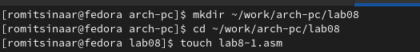{#fig:001 width=70%}

Отредактируем созданный файл (рис. @fig:002).

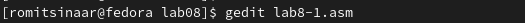{#fig:002 width=70%}

Откроем его и внесем программу из листинга (рис. @fig:003).

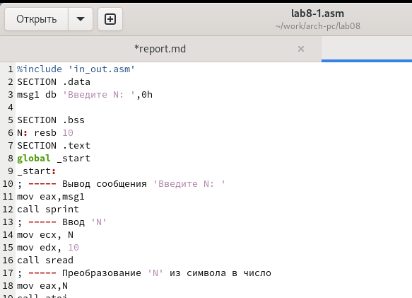{#fig:003 width=70%}

Запустим созданный файл (рис. @fig:004).

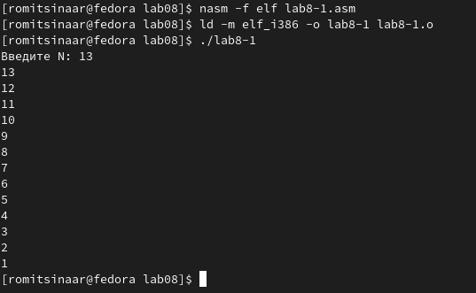{#fig:004 width=70%}

Отредактируем созданный файл (рис. @fig:005).

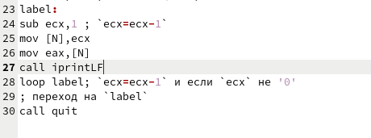{#fig:005 width=70%}

Запустим отредактированный файл, числа начинаются не с заданного, а с числа на 1 меньше и заканчиваются 0, а не 1(рис. @fig:006).

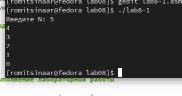{#fig:006 width=70%}

Отредактируем файл по примеру (рис. @fig:007).

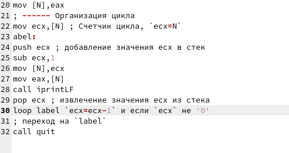{#fig:007 width=70%}

Запустим отредактированный файл, количество значений соответствует заданному N(рис. @fig:008).

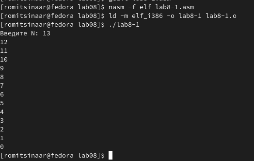{#fig:008 width=70%}

Создадим новый файл(рис. @fig:009).

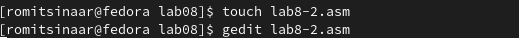{#fig:009 width=70%}

Внесем в файл программу из примера (рис. @fig:010).

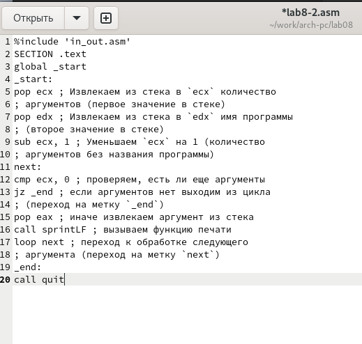{#fig:010 width=70%}

Запустим отредактированный файл, все значения выводятся(рис. @fig:011).

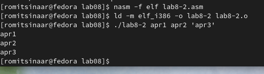{#fig:011 width=70%}

Создадим новый файл и заполним его программой и листинга(рис. @fig:012).

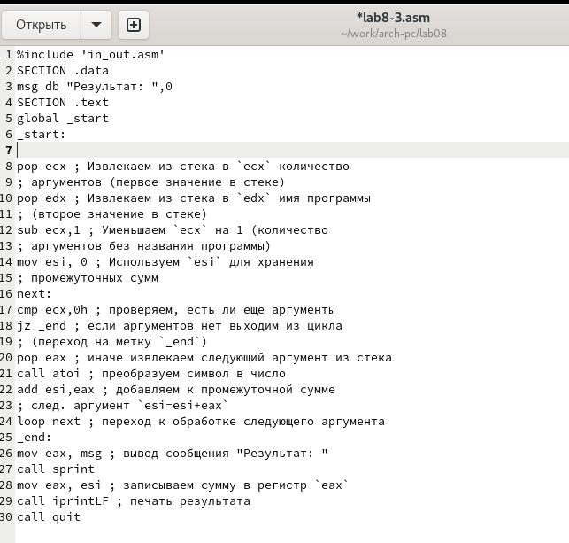{#fig:012 width=70%}

Запустим отредактированный файл, все значения выводятся как в примере(рис. @fig:013).

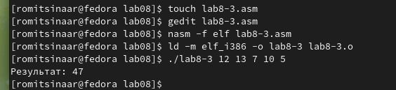{#fig:013 width=70%}

# Задания для самостоятельной работы

Создадим новый файл и отредактируем его(рис. @fig:014).

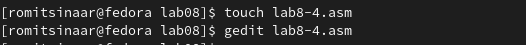{#fig:014 width=70%}

Напишем программу (рис. @fig:015).

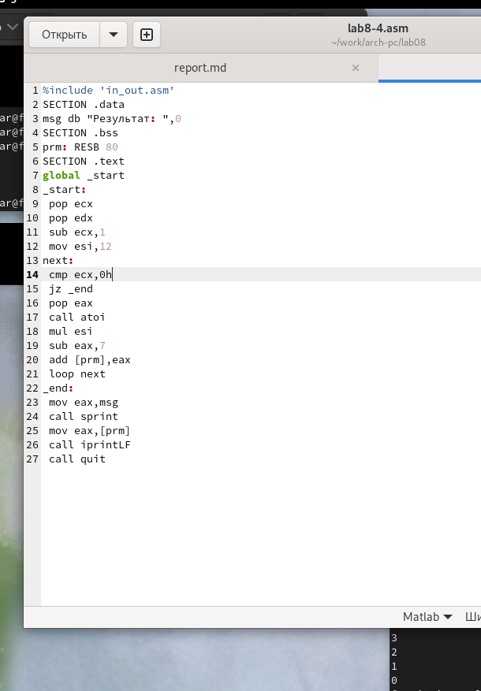{#fig:015 width=70%}

Запустим программу и проверим ее работу (рис. @fig:016).

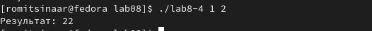{#fig:016 width=70%}

# Выводы

Мы приобрели навыки написания программ с использованием циклов и обработкой
аргументов командной строки.

